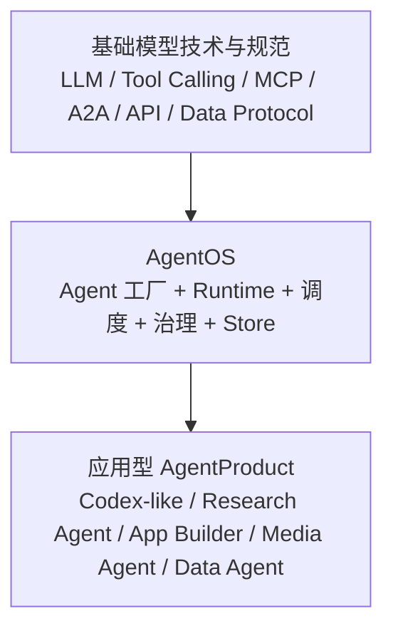
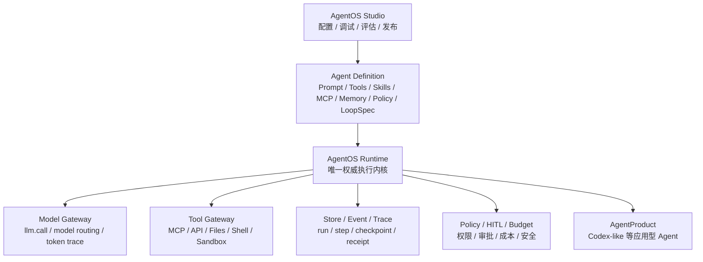
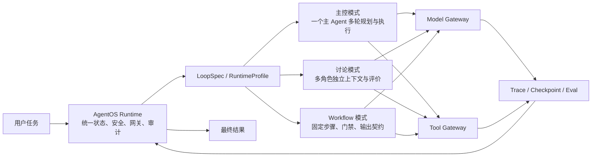
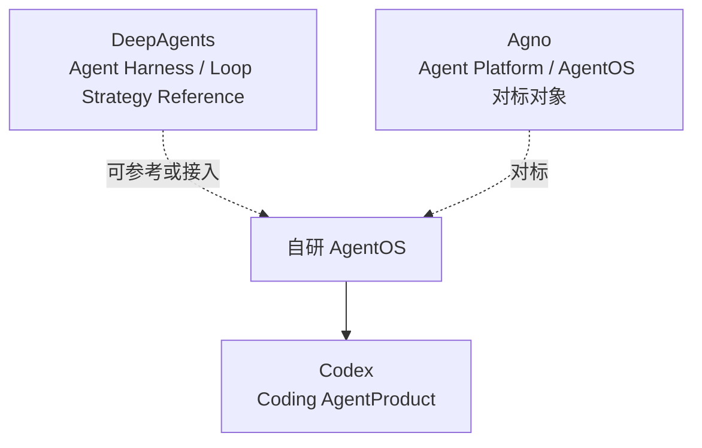

# AgentOS Runtime Architecture Analysis

日期：2026-06-03
类型：analysis
项目：personal-agent
来源：AgentOS runtime architecture analysis 整理
版式：金字塔结构，结论先行，图文并存

## Summary

本次讨论的核心结论是：AI Agent 体系可以按三层理解，分别是基础模型技术与规范、基于这些能力建设的 AgentOS、以及基于 AgentOS 建设的应用型 AgentProduct。AgentOS 不只是 Agent 工厂，而是 Agent 工厂、运行时、调度中心和治理系统的组合。

在这个范式下，Codex-like 产品应当是 AgentOS 能建设出来的垂直 AgentProduct；DeepAgents 更像单个复杂 Agent 的 agent harness；Agno 则更接近 AgentOS 或 agent platform 的对标对象。

Runtime 设计上，建议只保留一套权威 AgentOS Runtime。主控、讨论、workflow、多 Agent 协作等不应演化成多套 runtime，而应沉淀为 Agent 设计中的结构化 LoopSpec 或 RuntimeProfile。Prompt 只表达角色语义，LoopSpec 表达执行结构，AgentOS Runtime 负责解释执行并统一模型调用、工具调用、状态、安全、审计和成本。

## Decision

- 采用三层体系：基础模型技术与规范、AgentOS、应用型 AgentProduct。
- AgentOS 的定位是 Agent 工厂 + Runtime + 调度 + 治理，而不是单纯 prompt 编排工具。
- Codex-like 应作为 AgentOS 上的应用型 AgentProduct，而不是 AgentOS 本身。
- DeepAgents 可作为 harness 参考或运行策略组件，但不替代 AgentOS。
- Agno 是重要对标对象，它已经在做 SDK、runtime、API、control plane、安全、调度和观测一体的 agent platform。
- Runtime 层只保留一套权威 AgentOS Runtime。
- 主控、讨论、workflow、多 Agent 协作应作为 LoopSpec / RuntimeProfile，不作为独立 runtime。
- 多 Agent 协作只有在引入不同上下文、工具权限、模型、检查点或评价标准时才有工程价值；否则容易退化为 prompt hack。

## Scope

本报告覆盖：

- AgentOS 与 AgentProduct 的体系分层。
- Codex、DeepAgents、Agno 在该体系中的位置。
- AgentOS Runtime 与 loop 策略的关系。
- Execution Strategy、Middleware、LoopSpec 的职责边界。
- 多 Agent 协作的价值判断。
- 安全和治理边界。

本报告不覆盖：

- 具体数据库 schema。
- 具体 Studio 页面设计。
- 具体模型 provider 或 MCP server 实现。
- Codex-like 产品的完整功能规格。
- Agno 或 DeepAgents 的源码级审计。

## Architecture

### Three-layer Stack



### AgentOS As Product Factory And Runtime



### One Runtime, Multiple Loop Profiles



### External References In The Stack



## Key Concepts

### AgentOS

AgentOS 的核心价值不是拥有所有模型和工具，而是把模型、工具、数据、权限、状态、评估、审计和执行策略组织成可运行、可治理、可持续调优的平台。

AgentOS 应当能支持用户通过 Studio 配置一个 Codex-like AgentProduct，并通过增加 MCP、增加 Skill、调整工具权限、切换 LoopSpec、修改评估标准等方式，逐步逼近成熟代码 Agent 产品的能力。

### Codex-like

Codex-like 是 AgentOS 上的垂直产品实例。它需要读取代码、修改文件、运行命令、调试、review、测试、生成 diff 或 PR，并且全过程可审计、可恢复、可控权。

如果 AgentOS 不能建设出 Codex-like 这种完整产品体验，它更像 Agent Runtime 或 Agent Harness，而不是完整 AgentOS。

### DeepAgents

DeepAgents 的定位是 agent harness：围绕复杂任务提供 planning、filesystem、context management、subagents、memory、HITL、skills 等内置能力。它解决的是“一个复杂 Agent 怎么跑得更深、更稳”。

DeepAgents 不应替代 AgentOS 的控制平面、安全边界、AgentProduct 生命周期和业务权限模型。它可以作为参考实现、实验 harness，或被封装为 AgentOS 内的某类 LoopSpec/strategy。

### Agno

Agno 明确在做 agent platform：SDK、AgentOS runtime、API、storage、observability、security、scheduling、control plane。它与本讨论中的 AgentOS 定位高度接近，是重要对标对象。

差异化方向应重点放在：Studio 配置优先、Codex-like 架构调优闭环、业务级权限模型、工具/Skill/MCP 生态、以及 LoopSpec 的结构化产品能力。

## Runtime Boundary

从最原子的模型交互看，确实只有：

```text
llm.call(input)
llm.call.resp(output)
```

但 Agent Runtime 不是 LLM Runtime。Agent Runtime 负责管理多次模型调用、工具调用、状态、上下文、权限、安全、检查点、评估和结果收敛。

推荐边界：

- AgentOS Runtime：唯一权威执行内核。
- LoopSpec / RuntimeProfile：描述本次 Agent run 的协作和执行结构。
- Model Gateway：统一模型调用、路由、fallback、token 统计和 trace。
- Tool Gateway：统一工具 schema、权限检查、执行、receipt 和 HITL。
- Middleware：在模型调用、工具调用、状态写入前后做增强，例如 memory 注入、PII 检测、上下文压缩、eval 打点。

不推荐：

```text
AgentOS Runtime
  -> DeepAgents Runtime
  -> 各自管理 session/tool/memory/approval/trace
```

推荐：

```text
AgentOS Runtime
  -> 解释 LoopSpec
  -> 统一调用 Model Gateway / Tool Gateway / Store / Policy
```

## LoopSpec Versus Prompt

主控、讨论、workflow、多 Agent 协作不应只写在 prompt 中。Prompt 负责角色语义，LoopSpec 负责执行事实。

示例：

```yaml
runtime_profile:
  mode: workflow
  max_turns: 12
  actors:
    - id: planner
      tools: ["read_file", "grep"]
    - id: developer
      tools: ["read_file", "edit_file", "shell"]
    - id: reviewer
      tools: ["read_file", "grep", "test"]
  steps:
    - actor: planner
      output: plan
    - actor: developer
      input: plan
      output: patch
    - actor: reviewer
      input: patch
      output: review
  stop_condition:
    - tests_passed
    - reviewer_approved
```

判断标准：

- 如果只是同一个模型、同一上下文、同一工具集轮流扮演不同角色，大概率是 prompt hack。
- 如果引入不同上下文、不同工具权限、不同模型、不同 checkpoint、不同评价标准和可审计的输出契约，则是有工程价值的执行策略。

## Security

AgentOS 的安全边界必须上移到统一 runtime 和 gateway，而不是分散在每个 harness 或 prompt 中。

关键原则：

- 默认拒绝，高风险能力必须显式授权。
- 每个 Agent / Preset / Tenant 都有工具白名单和资源 scope。
- 子 Agent 默认降权，不能自动继承父 Agent 的全部权限。
- 所有 MCP、HTTP、script、shell、sandbox、文件和数据访问都经过 Tool Gateway。
- Secret 不进入 sandbox，通过受控代理或授权上下文注入。
- 所有 tool call 必须产生 receipt，并记录 runId、tenant、actor、preset、tool、args 摘要、结果、成本和审批状态。
- HITL 是 policy 的一部分，而不是模型主动“礼貌询问”的 prompt 行为。

## Flow

1. AgentProduct 用户在 Studio 创建或修改 AgentDefinition。
2. AgentDefinition 选择模型、工具、MCP、Skill、Memory、Policy 和 LoopSpec。
3. AgentOS Runtime 创建 run，加载 AgentDefinition 和权限上下文。
4. Runtime 按 LoopSpec 组织唯一主 loop。
5. 每次模型调用都通过 Model Gateway。
6. 每次工具调用都通过 Policy 和 Tool Gateway。
7. Runtime 写入 step、event、trace、checkpoint 和 receipt。
8. 如果触发 HITL，run 暂停并等待审批或人工输入。
9. Runtime 根据 LoopSpec 的 stop condition、eval 或 reviewer 结果收敛。
10. AgentProduct 向真实用户交付结果。
11. Studio 基于 trace、eval、失败点和成本继续调优 AgentDefinition。

## Checklist

- [x] 明确三层体系：基础模型技术与规范、AgentOS、应用型 AgentProduct。
- [x] 明确 AgentOS 不只是 Agent 工厂，还包括 runtime、调度、治理和安全。
- [x] 明确 Codex-like 是 AgentOS 可建设的垂直 AgentProduct。
- [x] 明确 DeepAgents 是 harness，不是完整 AgentOS。
- [x] 明确 Agno 是 AgentOS 级别的重要对标对象。
- [x] 明确只保留一套权威 AgentOS Runtime。
- [x] 明确 Agent 协作方式通过 LoopSpec / RuntimeProfile 表达。
- [x] 明确 prompt 与 LoopSpec 的职责边界。
- [x] 明确多 Agent 协作的价值判断标准。
- [x] 明确平台级安全需要统一 gateway、policy、receipt 和审计。

## Validation

本报告基于以下资料和讨论结论整理：

- 本地 `agent-hub` 仓库规则与报告结构。
- OpenAI Codex 官方手册中对 Codex 的定位：coding agent for software development。
- LangChain Deep Agents 文档中对 DeepAgents 的定位：agent harness，内置 planning、filesystem、subagents、memory、HITL、skills 等能力。
- LangChain 对 framework、runtime、harness 的分层说明。
- Agno README 与文档中对 Agno / AgentOS 的定位：build, run, and manage agent platforms；AgentOS runtime、API、storage、observability、security、scheduling、control plane。

参考链接：

- https://developers.openai.com/codex/codex-manual.md
- https://docs.langchain.com/oss/python/deepagents/overview
- https://docs.langchain.com/oss/python/concepts/products
- https://github.com/agno-agi/agno
- https://docs.agno.com/
- https://docs.agno.com/agent-os/introduction

## Follow-ups

- 定义 AgentDefinition 的最小 schema，包括 model、tools、mcp、skills、memory、policy、LoopSpec。
- 定义 LoopSpec 的三种基础 profile：main-controller、workflow、discussion。
- 设计 Tool Gateway 的统一 receipt 结构。
- 设计 Codex-like AgentProduct 的验收基准：读代码、改代码、跑测试、review、输出 diff、trace 可回放。
- 对 Agno 做更系统的产品和架构对标，明确自研 AgentOS 的差异化边界。
- 对 DeepAgents 做 harness 能力清单拆解，判断哪些能力应内化为 LoopSpec、middleware 或 gateway 能力。
