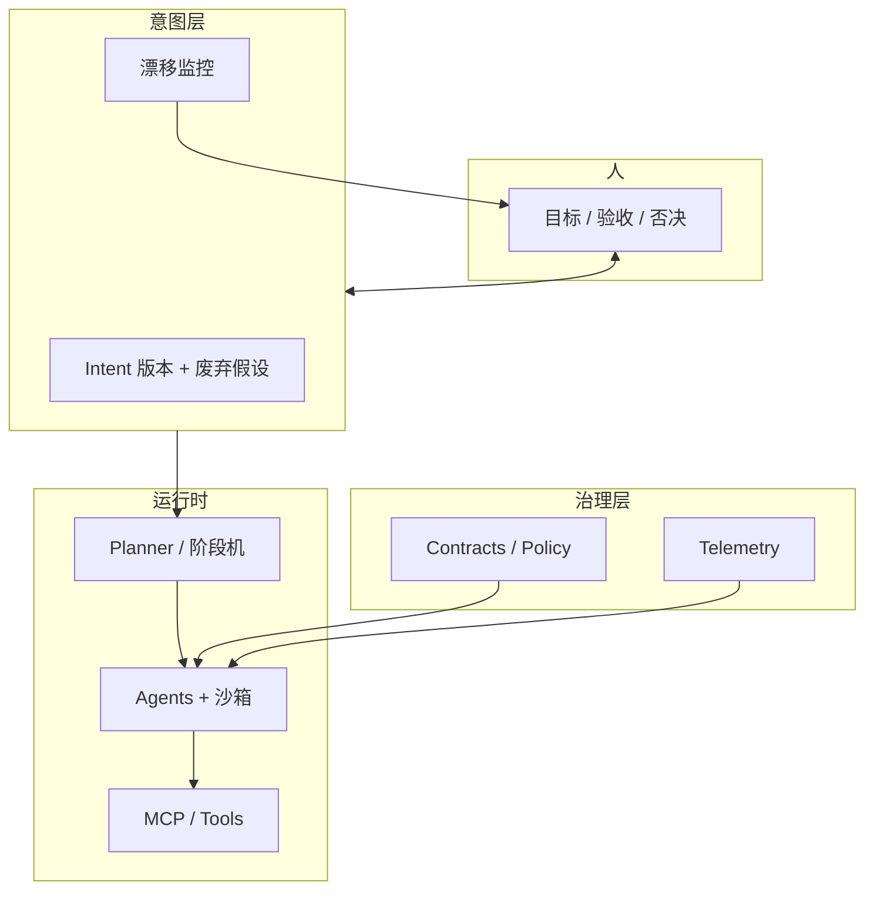

# 人机对齐 GAP、双目标债务与 AgentOS 思考研究报告

日期：2026-06-03
类型：chat
项目：personal-agent
来源：paper record 对话整理
版式：金字塔结构，结论先行，图文并存
主题：与 LLM 协作的认知成本、需求 GAP、学界/工业进展及 AgentOS 设计参考

## Summary

- 与 LLM 深度协作的主要成本常在**对齐**而非生成：用户「想要的」与「说清的」之间存在结构性 GAP，且修正成本随轮次累积（**curr-target** 与 **old-target** 双债）。
- 当前模型与框架**缓解了**描述↔理解、改目标的工程成本，但**未解决**探索型任务中「用户尚不清楚要什么」的本质问题。
- 学界已形成 **Intent Drift**、**Agent/Constraint Drift**、轨迹级对齐、人-AI 需求工程（HARE-SM）、非线性共创等可产品化方向。
- 工业 AgentOS 趋同于：意图层 + 规划/阶段机 + 记忆分层 + MCP 工具 + **独立治理/契约层** + 全链路 telemetry；缺口在**意图版本化**与**显式废弃假设**。
- 个人工作流可先在现有工具中模拟 AgentOS：Explore / Narrow / Execute 三阶段、假设外显、小步可逆、双指标验收。
- 自建 AgentOS 应把 **IntentRecord**、**Assumption Ledger**、**Re-anchor Protocol**、**探索/执行硬开关** 作为一等公民，北极星指标关注 reanchor 时延与约束保留率。

## Problem

### 用户原始痛点

1. **精神成本高**：LLM「知道的多」、人「知道的少」，对话中持续做翻译、决策与校对。
2. **需求不清晰**：用户常不知道自己真正要什么；内心目标与口述给 AI 的内容不一致。
3. **双目标债务**：
   - **curr-target gap**：当前轮才想清楚目标 B，但上下文与产物仍朝 A 推进。
   - **old-target gap**：更早轮次形成的隐性规格（命名、结构、讨论共识）继续约束后续行为。

修正一次目标，往往需同时偿还两层债务，故**越晚澄清越贵**。

### 问题结构（对话中形成的模型）


三方（心里想的 / 说出口的 / 模型执行的）可两两不一致；多轮「看似在推进」会掩盖漂移。

## Discussion

### 模型与框架「解决了多少」

| 维度 | 现状 |
|------|------|
| 描述 ↔ 理解 | **明显缓解**（澄清、规划、多模态） |
| 想清楚 ↔ 描述 | **基本未解**（工具辅助探索，不能代替决策） |
| curr / old 双债 | **部分缓解**（Plan 模式、Rules、小步 diff、分支） |
| 聊天疲劳 | **略缓解**（agent 代劳），**验收仍在人** |

框架擅长「目标给定后的执行」，不擅长「共同发现目标」；长上下文减轻丢约束，但会让 **old-target 以对话形式固化**。

### 学界与工业：三条研究线

**1. 轨迹级对齐（Trajectory-level）**

- **Intent Drift**：多轮中每步局部正确，整条轨迹偏离用户意图（非单点幻觉）。
- **Intent Drift Score (IDS)**：语义/结构/时间信号，前缀单调，可在线监控长对话。  
  参考：[NeurIPS 2025 — Towards Trajectory-Level Alignment](https://neurips.cc/virtual/2025/128062)

**2. Agent 行为与约束漂移**

| 类型 | 含义 |
|------|------|
| Semantic drift | 语义偏离最初目标 |
| Coordination drift | 多 agent 共识崩解 |
| Behavioral drift | 策略漂移（捷径、换打法） |
| Constraint drift | 安全/边界约束在执行中「褪色」 |

- **Agent Stability Index (ASI)**：量化长交互行为退化 — [arXiv:2601.04170](https://arxiv.org/pdf/2601.04170)
- **Agent Behavioral Contracts (ABC)**：可执行契约 + 运行时 enforcement — [arXiv:2602.22302](https://arxiv.org/pdf/2602.22302)
- **Constraint drift**：约束须在整个轨迹上**维持**，不能只在开头声明 — [arXiv:2605.10481](https://arxiv.org/html/2605.10481)

评估应拆分：**任务效用** vs **约束保留**；最终输出好看但轨迹违规应判失败。

**3. 探索型需求与人机 RE**

- **HARE-SM**：AI 抽取/歧义检测，人裁决 — [arXiv:2510.25016](https://arxiv.org/html/2510.25016)
- **多 agent RE**：约 2 轮人类反馈常能收窄需求；人负责语境与优先级 — [e-Informatica 2026](https://www.e-informatyka.pl/attach/e-Informatica_papers/eInformatica2026Art03.pdf)
- **非线性共创**：align → remix → 再 align — [Co-design Framework](https://arxiv.org/html/2401.07312v3)
- **Ideation scaffolding**：搜索/创造/评估可切换，提供可选脚手架（变体、风险、steering）— [arXiv:2509.12408](https://arxiv.org/html/2509.12408v3)

### 工业 AgentOS 共性架构



组件脊柱（综述）：goal manager → planner → tool-router → executor → memory → verifier → safety monitor → telemetry — [Agentic AI Architectures Ch.3](https://arxiv.org/html/2512.09458v1)

**已做**：长上下文、Plan/Ask、项目记忆、MCP、子 agent、审计。  
**未做好**：意图作为可版本对象、显式 supersede、探索/执行硬隔离、双指标评分。

### 个人/团队工作流（在 Cursor 等环境中）

| 阶段 | 目标 | 做法 |
|------|------|------|
| Explore | 发现可能要什么 | Ask/Plan；要选项与权衡；**禁止改仓库** |
| Narrow | 暂定目标成文 | 一页 spec：目标、非目标、验收、**废弃项** |
| Execute | 实现 | Agent；小步可逆；定期 **REANCHOR** 一句 |

- **old-target** 赶出聊天：Rules、AGENTS.md、Skills、Notion/issue spec（变更写 Supersedes）。
- **curr-target** 降本：先接口/测试清单；worktree 并行试路；人只做抽检与关键决策。

### AgentOS 设计建议（一等公民）

**核心对象**

```text
IntentRecord: id, version, status(draft|active|superseded), goal, non_goals, acceptance, assumptions[], phase
TrajectoryEvent: turn, action, tools, intent_version, ids_score?, violations[]
Contract: invariants, tool_allowlist, budget, human_gate_on[]
```

**对付双债的机制**

1. **Assumption Ledger**：假设带 id；用户否定时 supersede + 扫描依赖 artifact + delta plan。
2. **探索/执行硬开关**：explore 只读或 dry-run；写盘需 `intent.active` 且 `phase=execute`。
3. **双指标**：task utility × constraint preservation。
4. **Re-anchor Protocol**：固定格式注入所有活跃 agent（VOID / KEEP / GOAL）。
5. **记忆分层**：Working / Episodic（只追加）/ Semantic（慢写入、人审）/ Intent store（仅 supersede 变更）。

**多 agent 默认**：1 Orchestrator + N Specialist（受限写）+ 1 Verifier（无写）+ 人只在 gate。

**实施路线**

```text
V0: Intent 版本 + Event log + 阶段机
V1: Contract on tools + 双指标
V2: 假设登记 + 依赖扫描
V3: IDS/ASI 类漂移监控
```

**北极星指标**

- Time-to-reanchor  
- Supersede cleanup rate  
- Dual score（任务成功 × 约束保留，分开报）  
- Human decision minutes per delivered artifact  

## Research & References

| 主题 | 链接 |
|------|------|
| Intent Drift / IDS | https://neurips.cc/virtual/2025/128062 |
| Agentic AI 架构综述 Ch.3 | https://arxiv.org/html/2512.09458v1 |
| Constraint drift | https://arxiv.org/html/2605.10481 |
| Agent Stability Index | https://arxiv.org/pdf/2601.04170 |
| Agent Behavioral Contracts | https://arxiv.org/pdf/2602.22302 |
| HARE-SM | https://arxiv.org/html/2510.25016 |
| Scaffolding ideation | https://arxiv.org/html/2509.12408v3 |

## Implications

- **产品**：对齐应可观测、可版本化、可回滚；Prompt 不能替代规格与契约。
- **AgentOS**：价值在于把「对齐很贵」系统化为 Intent 层 + 治理层，而非再堆一个 agent 框架。
- **协作习惯**：探索期误执行是 old-target 债务最大来源；精神成本主要在决策与验收，应产出可比较中间物而非大块不可逆代码。

## Recommendations

1. 在 agent-hub 已落地 **paper record** 技能与规则；后续任意长对话用该关键字即可归档。
2. 若实现 AgentOS V0，优先 **IntentStore + phase 机 + append-only event log**，再接 MCP 与 Contract。
3. 团队统一 **REANCHOR** 口令与 spec 中的 Supersedes 字段，降低跨会话 old-target。

## Open Questions

- 个人开发者 OS vs 企业多 agent 控制面：优先级与合规要求差异未在本对话定稿。
- IDS/ASI 类产品化阈值与误报成本需实证。
- paper record 是否应对「跨多会话同一主题」做合并修订版（v2 报告）— 待用户偏好。

## Follow-ups

- [ ] 可选：为 agent-hub 增加 `skills/paper-record` 在 `skills/README.md` 的索引说明
- [ ] 可选：将 IntentRecord / Assumption Ledger 草图沉淀为 `reports/personal/agent/analysis/` 专题
- [ ] 用户指定 project-slug 时，后续 paper record 写入对应 `reports/<project>/chat/`
