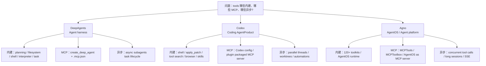

# DeepAgents / Codex / Agno Tools 来源边界与清单整理

日期：2026-06-06
类型：chat
项目：personal-agent
来源：当前聊天中对 DeepAgents、Codex、Agno / agno-agi 的 tools 来源、MCP 接入和异步能力整理
版式：金字塔结构，结论先行，表格为主，保留来源边界
主题：在明确“联网、不要参考本地”的来源约束下，整理三类 Agent 体系的内建工具、MCP 工具和异步 / 后台工具，并沉淀来源硬边界规则。

## Executive Summary

一句话结论：DeepAgents 更像复杂任务 agent harness，内建 planning / filesystem / subagent 能力最集中；Codex 更像 coding AgentProduct，代码编辑、本地执行、浏览器和自动化工具链最完整；Agno 更像 AgentOS / agent platform，对 toolkit、MCP 和长会话 runtime 的平台化承载更系统。

关键判断：

1. `内建 tools`、`MCP tools` 和 `异步 / 后台 tools` 是三条不同分类轴，不能混成一个“工具列表”。
2. DeepAgents 的内建能力主要来自 harness / middleware：`write_todos`、filesystem、shell backend、interpreter、subagent、HITL、tool selector、retry 等。
3. Codex 的内建能力更偏代码产品工作流：shell、`apply_patch`、tool search、code interpreter、computer use、file search、browser、worktrees、automations、skills / plugins。
4. Agno 的内建能力更偏 platform toolkit：大量 pre-built toolkits、AgentOS runtime、控制平面、会话、trace、RBAC、MCP in / MCP out。
5. 本轮发生一次重要来源纠偏：用户明确要求“联网，不要参考本地”后，事实结论必须只来自联网官方文档；本地资料只能用于仓库规则和归档操作，不得作为事实依据。

## Decision / Thesis

最终整理采用以下口径：

```text
内建
  = 官方 SDK、产品、runtime、middleware 或 toolkit 自带能力

MCP
  = 通过 MCP server、MCPTools、connector、plugin 或配置文件接入的外部工具面

异步 / 后台
  = 非阻塞、后台、可查状态、可更新、可取消、可长期会话或 durable runtime 的执行模式
```

来源策略采用硬边界：

- 用户未限定来源时，可以先读本地仓库规则和既有报告来理解上下文。
- 用户明确限定“联网”“不要参考本地”时，本地资料不能作为事实来源。
- 最终输出需要说明事实来源范围，避免把本地沉淀、外部官方文档和推断混在一起。

该策略已沉淀为通用规则，写入 `AGENTS.md` 的 `User Collaboration Style` 小节。

## Why / Evidence

本轮联网事实依据来自官方文档，而非本地报告：

- DeepAgents 官方文档：
  - https://docs.langchain.com/oss/python/deepagents/overview
  - https://docs.langchain.com/oss/python/deepagents/middleware
  - https://docs.langchain.com/oss/python/deepagents/async-subagents
  - https://docs.langchain.com/oss/python/deepagents/code/mcp-tools
- Codex / OpenAI 官方文档：
  - https://developers.openai.com/codex
  - https://developers.openai.com/codex/mcp
  - https://developers.openai.com/codex/app/features
  - https://developers.openai.com/codex/app/browser
  - https://developers.openai.com/codex/app/computer-use
  - https://developers.openai.com/api/docs/guides/tools-shell
  - https://developers.openai.com/api/docs/guides/tools-apply-patch
  - https://developers.openai.com/api/docs/guides/tools-tool-search
  - https://developers.openai.com/api/docs/guides/tools-code-interpreter
- Agno 官方文档：
  - https://docs.agno.com/tools/overview
  - https://docs.agno.com/tools/toolkits/overview
  - https://docs.agno.com/tools/mcp/overview
  - https://docs.agno.com/tools/mcp/mcp-toolbox
  - https://docs.agno.com/agent-os/introduction
  - https://docs.agno.com/agent-os/mcp/mcp

证据归纳：

- DeepAgents 文档明确列出 built-in capabilities，包括 planning、context management、filesystem、shell execution、interpreter、subagent spawning、streaming、memory、filesystem permissions、HITL 和 skills。
- DeepAgents MCP 文档说明 Deep Agents Code 可从 `.mcp.json` 自动发现 MCP server 并把外部 tools 与 built-in tools 一起提供给 agent。
- DeepAgents async subagents 文档说明 supervisor 可启动后台 subagent，并通过 start / check / update / cancel / list 工具管理。
- Codex 文档把 shell、apply patch、tool search、code interpreter、computer use 等列入 OpenAI / Codex 工具面；Codex app 文档补充了 in-app browser、Chrome extension、Computer Use、automations、worktrees 和 plugins / skills。
- Codex MCP 文档说明可通过配置或插件接入 MCP server，并存在 server/tool 级 approval policy。
- Agno 文档说明 tools 是 Agents / Teams 用于真实动作的 functions，Agno 有大量 pre-built toolkits；`MCPTools` 可连接 stdio / SSE / HTTP，AgentOS 可暴露为 MCP server。
- Agno tools 文档说明 `arun` / `aprint_response` 下多个 tool call 可并发执行；AgentOS 文档强调 long-running sessions、durability、SSE、RBAC、tracing 和 control plane。

## Concept Map



## Tool Classification Table

| 体系 | 定位 | 内建 tools | MCP tools | 异步 / 后台 tools |
| --- | --- | --- | --- | --- |
| **DeepAgents** | 复杂任务 agent harness | - `write_todos`<br>- `ls` / `read_file` / `write_file` / `edit_file`<br>- context compression / summarization<br>- shell backend 的 `execute`<br>- interpreter<br>- 同步 subagent 的 `task`<br>- HITL / retry / tool selector 等 middleware | - `create_deep_agent` 可接 MCP server tools<br>- Deep Agents Code 可从 `.mcp.json` 自动发现 MCP tools<br>- MCP tools 与 built-in tools 一起暴露给 agent | - Async subagents<br>- `start_async_task`<br>- `check_async_task`<br>- `update_async_task`<br>- `cancel_async_task`<br>- `list_async_tasks` |
| **Codex** | 代码 AgentProduct / 本地与云 coding agent | - shell / local shell<br>- `apply_patch`<br>- tool search<br>- code interpreter<br>- computer use<br>- file search / retrieval<br>- web search<br>- image generation<br>- in-app browser<br>- worktrees<br>- skills / plugins<br>- automations | - Codex MCP 配置可接入 MCP server<br>- plugin 可打包 MCP server<br>- MCP tools 受配置、权限和 approval policy 控制 | - parallel threads<br>- background worktrees<br>- automations<br>- remote control<br>- locked computer use |
| **Agno / agno-agi** | Agent platform / AgentOS | - 120+ toolkits<br>- Web / Search<br>- Arxiv / DuckDuckGo<br>- SQL / Postgres / DuckDB / BigQuery<br>- CSV / Pandas<br>- Calculator<br>- Docker<br>- File / Local FS<br>- Python<br>- Shell<br>- Sleep | - `MCPTools` 连接 stdio / SSE / HTTP<br>- `MCPToolbox` 支持 toolset / tool name 过滤<br>- AgentOS 可暴露为 MCP server<br>- MCP server 可提供 `run_agent` / `run_team` / `run_workflow` / session / memory tools | - `arun` / `aprint_response` 并发执行多个 tool calls<br>- 同步 tools 可在线程中并发<br>- AgentOS 支持长会话<br>- SSE streaming<br>- durable runtime |

## Scenario Breakdown / Discussion

### 1. 为什么 DeepAgents 的表格重心是 harness

DeepAgents 文档把“复杂任务能跑得深”作为核心价值，默认能力围绕计划、上下文管理、filesystem、subagent、HITL 和 skills 展开。它不是完整 AgentOS 控制平面，而是让单个或一组 agent 在复杂任务中更稳的执行 harness。

因此 DeepAgents 的 `内建 tools` 不是办公或业务 SaaS 工具集合，而是 agent loop 和 context engineering 所需的结构性工具。

### 2. 为什么 Codex 的表格重心是 coding product

Codex 的工具面围绕真实软件工程工作流：读写文件、打 patch、跑 shell、检索、浏览器验证、Computer Use、worktree 隔离、automations、skills 和 plugins。它也支持 MCP，但 MCP 是扩展入口，不是 Codex coding 能力的全部来源。

Codex 的异步更偏产品层：并行 threads、后台 worktrees、automations、远程控制和 locked computer use，而不是只有某个 SDK 函数的 async / await。

### 3. 为什么 Agno 的表格重心是 platform

Agno 官方文档对 AgentOS 的定位是 runtime + control plane。它既有 SDK/toolkit 层的大量预置工具，也支持 MCPTools 消费外部 MCP server，还支持把 AgentOS 自身暴露成 MCP server。

因此 Agno 不能只看“某几个 tool name”，更应看三层：

```text
SDK tools / toolkits
  -> AgentOS runtime
    -> Control plane / API / session / memory / trace / RBAC / MCP exposure
```

### 4. 来源边界纠偏

本轮一开始曾按仓库规则读取本地长期上下文和报告，之后用户明确要求“联网，不要参考本地”。这构成了硬边界变更：后续事实表格只以联网官方文档为依据。

由此沉淀出的规则是：当用户指定信息来源时，来源范围本身就是需求的一部分；助手需要显式遵守，并在最终答案说明采用了哪些来源。

## Recommendations / Roadmap

后续做类似工具生态对比时，建议采用固定输出模板：

1. 先声明来源范围：本地 / 联网 / 官方文档 / 代码审计 / 混合。
2. 再声明分类轴：内建、MCP、异步、远端 provider、UI / 产品层后台。
3. 表格内必须分点换行，不把多个工具压成一段横向长文本。
4. 对“异步”区分：
   - async function / concurrent calls
   - background task
   - long-running session
   - durable runtime / resumable workflow
5. 对“MCP”区分：
   - 消费外部 MCP server
   - 把自身暴露为 MCP server
   - 通过 plugin / connector / toolbox 做治理和过滤

## Open Questions

- 是否需要继续做一份更严格的版本，按“官方文档明确 tool name / 官方文档明确 capability / 推断能力”三档标注可信度？
- 是否需要把 Codex 的工具面进一步拆成 `OpenAI API tools`、`Codex product tools`、`plugin tools`、`MCP tools` 四类？
- 是否需要对 Agno 的 120+ toolkits 做完整分组清单，而不是只列代表性类别？

## Follow-ups

- 已完成：将来源硬边界规则写入 `AGENTS.md`。
- 已完成：按用户要求把最终表格改成表格内部 `<br>` 分点换行版。
- 可选后续：如果需要正式对标报告，可另写 `reports/personal/agent/analysis/`，并对三套体系做更系统的功能矩阵、成熟度和产品定位拆解。
