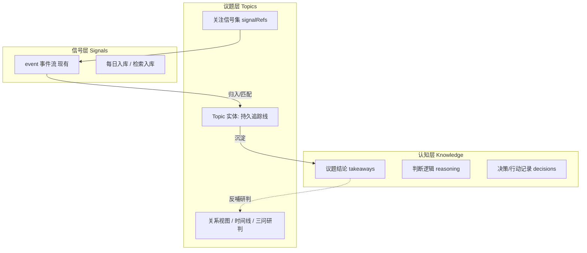

# auto-info 全栈重设计：议题为中心的情报操作系统

日期：2026-06-17
类型：refactor
项目：auto-info
作者：claude
来源：auto-info 前后端核心数据流直读（event-model / store / mysql-events / uc-001 日报 / uc-002 关系图）+ 用户对"持续积累知识与逻辑"的核心诉求
版式：金字塔结构，结论先行，图文并存

## 结论先行

auto-info 当前是「按工具切分的 6 tab 工具箱」：日报、分析、阅读、雷达、快访、配置各自为政。用户完成一次完整判断需跨 tab 手动搬运，且**每天的判断成果即用即弃**——今天建的关系图、得出的结论，明天打开就没了。这是用户"无法稳步积累知识与逻辑"的**结构性根因**。

重设计的内核：**把系统中心对象从「页面」换成「议题（Topic）」**，按三层重组——

```
信号层 Signals    raw 事件流（现有 event），每日流入
   ↓ 归入
议题层 Topics      持久追踪线：聚合相关信号的时间线 / 关系 / 三问研判
   ↓ 沉淀
认知层 Knowledge   用户对议题的结论、逻辑、决策记录（新增，可累积）
```

关键判断：
- **现有功能不删除，而是降格为议题下的视图/动作**：日报=今日信号入口；分析=议题的关系视图；阅读=对议题内某信号的深读；雷达=科技类议题的长周期视图。
- **"议题"不是凭空新增**：现有分析页已是"query→匹配事件→建关系图"，本质就是议题的**临时形态**，且已有别名映射（俄乌冲突/AI技术）。重设计 = 把这个临时 query **固化为持久实体**，并附加认知沉淀能力。
- **一次判断在一个议题内闭环**：发生了什么（新信号）→ 影响是什么（关系+研判）→ 我能做什么（行动+已沉淀结论），且跨天累积。三问框架从"首页一个面板"升级为"议题的组织骨架"。

## 一、现状事实基线（重设计的地基）

### 1.1 event 实体已足够丰富（无需重建）
`shared/event-model.mjs` 的 normalizeEvent 产出字段：`id / category / region / title / summary / tags[] / severity(0-100) / special / occurredAt / timeline[] / impacts[] / references[]`。timeline 点含 `at/label/text/synthetic`。

### 1.2 存储三分（保留，议题层挂在其上）
- JSON store（`data/*.json`，`store.mjs`）：事件源 + 日报归档，主力读写。
- MySQL（`mysql-events.mjs`，CLI 调用）：事件召回（按 query LIKE）。
- Neo4j（`neo4j-graph.mjs`，HTTP）：关系图持久化，不可用时内存降级。

### 1.3 关系是"实时算、不留存"
`uc-002 service.buildGraph(query)`：匹配事件→推断 nodes(dimension/level)→两两建 edges（shared_tag / same_category / impact_theme / keyword_overlap / cross_impact）→算 tone/weight→存 Neo4j→返回 chronology + eventLines。**每次查询重算，议题、结论、关注状态均不持久。**

### 1.4 已隐含的"议题"碎片
- `match-query.mjs` 的 `ALIAS_MAP`：俄乌冲突/中东局势/台海/AI技术… 已是议题别名库。
- 日报四块（国际/科技/金融/国内）= 粗粒度议题分类。
- 阅读页 `openReadingSession` 已能从其它视图跳转深读 = 跨视图串联雏形。

**结论：原料齐全，缺的是把"议题"提升为一等持久对象 + 认知沉淀容器。**

## 二、目标架构

### 2.1 三层对象模型



### 2.2 Topic 实体（新增的核心数据模型）

```
Topic {
  id: string                 // 系统生成，不可变（owning service 生成，非用户输入）
  title: string              // 用户可编辑展示名，如"美联储货币政策"
  slug: string               // 可读标识
  aliases: string[]          // 检索别名（迁移自 ALIAS_MAP）
  query: string              // 信号匹配查询（沿用现有 matchesAnalysisQuery）
  status: "active"|"watching"|"archived"
  createdAt / updatedAt
  signalRefs: string[]       // 归入本议题的 event id（持久化匹配结果，区别于实时算）
  pinnedSignalIds: string[]  // 用户钉选的关键信号
  knowledge: {               // 认知层（新增，可累积）
    takeaways: Note[]        // 结论：{ id, text, createdAt, sourceSignalIds[] }
    reasoning: Note[]        // 逻辑/推理链
    decisions: Note[]        // 决策与行动记录
  }
  lastReviewedAt: string     // 上次研判时间，驱动"待研判"提醒
}
```

设计约束（遵循 AGENTS.md 资源身份规范）：
- `id` 由后端生成、不可变；用户输入只进 `title/aliases/query`。
- Topic 不复制 event 内容，只存 `signalRefs`（id 引用），事实源仍是 event store。
- knowledge 是 Topic 私有子文档，随 Topic 持久化。

### 2.3 存储落点
- 新增 `data/topics.json`（与现有 store 同构的 JSON 主存，最小改动、可快速验证）。
- 后续可选迁 MySQL（topics 表 + topic_signal 关联表），但**首版用 JSON**，避免一次性引入 DB schema 风险。
- 关系图：议题打开时仍用 uc-002 的 buildGraph，但 query 来自 Topic.query（复用现有算法，0 重写）。

## 三、后端 API（新增 uc-007-topics，不动现有 6 UC 内部）

```
GET    /api/v1/topics                  列出议题（带未读信号数/待研判标记）
POST   /api/v1/topics                  创建议题 { title, query, aliases? }
GET    /api/v1/topics/:id              议题详情（聚合：信号集+关系+研判+认知）
PATCH  /api/v1/topics/:id              更新 title/query/aliases/status
DELETE /api/v1/topics/:id              归档/删除
POST   /api/v1/topics/:id/refresh      重新匹配信号，更新 signalRefs（增量）
POST   /api/v1/topics/:id/knowledge    追加 takeaway/reasoning/decision
GET    /api/v1/topics/:id/graph        议题关系图（内部转调 uc-002 buildGraph(topic.query)）
```

复用现有能力：信号匹配 = `matchesAnalysisQuery`；关系图 = `buildGraph`；时间线 = `buildEventChronology`。新增的只是**持久化与认知 CRUD**，不重写情报算法（壁垒资产保留）。

## 四、前端信息架构重组

### 4.1 从 6 tab 到「议题工作台」

```
┌─ 顶栏：议题切换器 + 全局检索（⌘K 入库/建议题） + 主题切换 ─┐
│                                                          │
│  左：议题导航          中：当前议题工作区        右：认知栏  │
│  ─────────         ──────────────         ────────  │
│  ● 今日总览          [议题标题 + 状态]            结论       │
│  ● 美联储政策 ③      ┌─────────────┐          逻辑       │
│  ● AI芯片竞争 ①      │01 发生了什么 │          决策记录    │
│  ● 我的旅行计划       │  新信号时间线 │          ＋ 沉淀     │
│  ● + 新建议题        ├─────────────┤                    │
│                     │02 影响是什么 │                    │
│  ─ 归档 ─           │  关系图+研判  │                    │
│                     ├─────────────┤                    │
│                     │03 能做什么   │                    │
│                     │  行动+深读链 │                    │
│                     └─────────────┘                    │
└──────────────────────────────────────────────────────┘
```

- **今日总览**（默认落地）：跨议题的今日新信号聚合（替代原首页日报），每条信号标注"归属议题"，可一键归入议题或新建议题。这是"信号流入口"。
- **议题工作区**：选中议题后，中栏即三问骨架（复用已建的 ThreeQuestionLens 逻辑，但数据源从"当日全部"变为"本议题"），跨天累积。
- **认知栏**：右侧常驻，记录/查看该议题的结论、逻辑、决策。这是新增的"积累容器"。

### 4.2 现有页面的归宿（功能不丢）
| 现有 | 重设计后归宿 |
|---|---|
| 首页日报 | 「今日总览」跨议题信号流 |
| 分析页 | 议题工作区的「02 影响是什么」关系视图 |
| 阅读助手 | 信号/议题的「深读」动作，结果可沉淀为认知 |
| 科技雷达 | 科技类议题的长周期时间线视图 |
| 快捷访问 | 降为设置内「常用链接」或保留为独立工具 |
| 配置 | 保留，进设置区 |

### 4.3 路由
引入真实路由（`/topics/:id`、`/today`），替代当前 zustand 状态机切页，支持深链与前进后退。议题可被收藏/分享为 URL。

## 五、迁移路径（关键：不破坏现有可用功能）

分阶段、每阶段可独立验证、旧功能全程可用：

| 阶段 | 内容 | 可验证信号 | 风险 |
|---|---|---|---|
| P0 | 后端 uc-007-topics + topics.json + Topic CRUD API；ALIAS_MAP 迁为种子议题 | API 单测；建/读/更新议题成功 | 低（纯新增，不动现有） |
| P1 | 议题信号匹配与 refresh（复用 matchesAnalysisQuery）；议题关系图转调 buildGraph | 议题详情返回正确信号集+关系 | 低 |
| P2 | 前端「今日总览」+ 议题导航 + 议题工作区（三问骨架接议题数据源）；引入路由 | 旧 6 tab 仍可达；议题流走通 | 中（信息架构变） |
| P3 | 认知层 UI（结论/逻辑/决策 CRUD + 沉淀入口） | 沉淀的认知跨会话持久、可回看 | 中 |
| P4 | 现有页面归位（分析→议题视图、阅读→深读动作、雷达→长周期视图）；快访降级 | 各原功能在新架构可达且不回归 | 中高（需逐一走查） |
| P5 | 收尾：旧首页/导航清理、文档、回归测试 | 构建通过、关键 workflow smoke | 中 |

迁移原则：P0-P1 后端先行且纯新增（现有前端零感知）；P2 起前端逐步切换，旧页面保留到 P4 才归位，保证任何阶段都可回退。

## 六、与已完成工作的衔接

近期已落地（见 `2026-06-16-关于auto-info-themeSystemAndThreeQuestionLens.md`）：主题系统、三问透镜、信号密度层。这些**全部可复用、不浪费**：
- 主题系统：议题工作台直接继承，无需改。
- `lib/threeQuestions.ts` 派生层：从"按当日全部事件"改造为"按议题 signalRefs"，核心归约逻辑复用。
- `lib/signalDensity.ts`：议题内信号同样需要去噪/折叠/评分，原样复用。

即本次重设计是**把已建的三问从"首页面板"提升为"议题骨架"**，是演进而非推翻。

## 七、Validation（验收口径）

- P0-P1：后端 API 单测；议题 CRUD、信号匹配、关系图转调端到端返回成功业务结果（非空、非降级）。
- P2-P4：每个原功能在新架构下走查可达、数据真实（非 mock/fallback）；旧入口在归位前保持可用。
- 全程：遵循项目铁律——先 spec 后代码、密钥不入库、构建通过、唯一实现禁双份。
- 验证语义：只有"在议题内完成 看见信号→研判→沉淀认知→下次打开认知仍在"的完整闭环跑通，才算"议题工作台可用"。

## 七点五、范围收敛（2026-06-17 二次对齐，覆盖早期假设）

用户进一步明确产品本质，对早期"保留全部 6 功能、降格为视图"的假设做了收敛。**最终产品 = 一个情报分析引擎，两种使用姿势：**

- **拉（按需分析）**：给一个具体问题（某股票/某事件）→ 检索+关联+**可视化**→ 帮用户看懂**全貌与内在逻辑**（不是给链接列表）。
- **推（主动收集）**：养着持续关注的议题 → 系统主动搜集、归整、必要时分析 → 认知跨天累积。

**功能做减法（硬决策）：**
- **保留**：情报分析（核心引擎）、议题（持续关注）、配置（源/key）。
- **阅读助手并入情报分析**：深读一篇来源、提炼要点是分析的一个环节，不作为独立功能/tab。
- **日报、科技雷达、快捷访问**：不再作为独立 tab 平铺；收敛进引擎或移除（用户未选保留）。
- **入口**：拉与推**分开两个区**呈现，不强行统一为单一输入框。

> 此节覆盖第二节"现有 6 功能降格为视图"的早期表述：方向从"全保留+降格"收紧为"只留分析引擎+议题+配置，其余并入或砍"。后续 P2/P4 以本节为准。

## 八、决策项（2026-06-17 已拍板）

1. **议题首版存储**：**JSON 主存** `data/topics.json`（与现有 store 同构，低风险快验证；后续按需迁 MySQL）。
2. **路由**：**引入 React Router**，`/topics/:id`、`/today` 真路由，支持深链/前进后退/分享。
3. **认知层粒度**：首版即**结论 takeaways / 逻辑 reasoning / 决策 decisions 三类**。
4. **种子议题**：**自动从 ALIAS_MAP 建初始议题**（俄乌冲突/中东局势/台海/AI技术/关税），开箱即有内容。
5. **快捷访问 UC-005**：暂定降级为设置内「常用链接」（P4 归位阶段再细化，非首版阻塞项）。

> 已拍板，P0 从后端 uc-007 落地；执行明细按项目约定记录，长期结论回流本报告。
