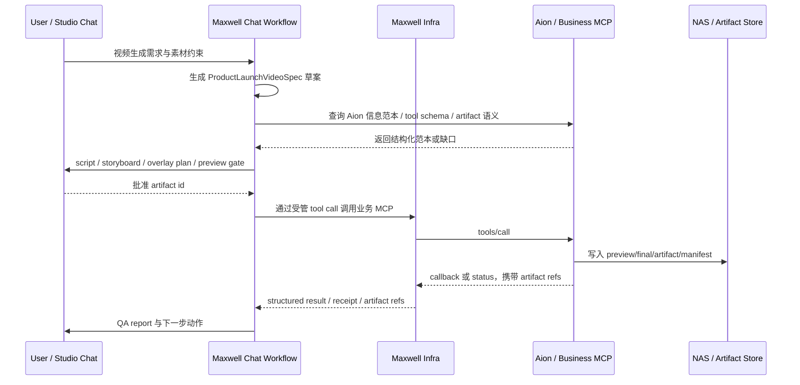

日期：2026-06-24
类型：analysis
项目：maxwell-ai
来源：Maxwell Studio 宣传视频 Chat case 复盘、Aion/MCP 项目沉淀与子 Agent 只读分析整理
版式：金字塔结构，结论先行，按前置条件、架构边界、能力缺口、工具契约与计划输入组织

# 关于视频生成 Chat Workflow Cost Gate

## Summary

这次沉淀的重点不是单独总结“视频模型生成 UI 文字会乱码”，也不是直接要求 Maxwell infra 增加一套视频生成业务逻辑。真正目标是：**在 Aion 已经能作为信息范本的前提下，补齐 Studio Chat 面向视频生成场景所缺的能力、工具契约和低成本门禁**。

前置判断必须清楚：

- 如果 Aion / 业务 MCP 已能提供视频、音乐、timeline、artifact、callback、成本和质量信息的结构化范本，那么 Maxwell Chat 可以基于该范本做“视频生成场景适配计划”。
- 如果 Aion 没有可读取的信息范本，或只能提供不可验证的自然语言描述，那么本轮只能记录能力缺口，不应让 Chat 编造改造方案。
- 无论 Aion 信息是否充分，都不得把 Aion 私有 provider、`media_task_url`、业务产物生成细节或视频流程硬编码进 agent-server/runtime core。

推荐目标链路仍是：

```text
brief -> script -> product-info-check -> storyboard -> text-overlay-plan -> preview -> final
```

但它应落在 **业务 MCP / 上层场景 workflow / Studio 配置与审批** 的边界内；Maxwell infra 只承载通用的 tool 调用、异步回执、artifact refs、callback 唤醒、状态追踪和可审计 Chat workflow。

## Existing Constraints

已有 Maxwell 项目沉淀给出的硬边界：

- Maxwell infra 是 agent 配置、调度、编排、迭代平台，不是单个垂直视频生成产品。
- 当前 `services/mcp-server` 按 Aion MCP Server 理解，不是通用 MCP server。
- Aion MCP 等业务 server 负责私有 tool、模型/provider 适配和通过 backend/SDK 写 NAS。
- agent-server/runtime core 只负责通用编排、model 调用、tool call、callback 唤醒、NAS/path/artifact refs 读取恢复。
- 视频生成、音乐生成、字幕对齐、timeline 渲染等长任务更适合走 MCP / provider bridge / async long-running tool，而不是普通 buildIn。
- MCP 接入 Maxwell 的稳定经验包括：`tools/list`、`tools/call`、`call_mode`、`status_tool_name`、`cancel_tool_name`、`structuredContent.status`、`provider_task_id`、artifact refs 和可重复查询 status。

因此，视频生成适配必须先问：哪些信息已经在 Aion 侧存在，哪些只是 Maxwell Chat 的编排/审批/展示需要，哪些才是平台通用契约。不能因为 Chat case 需要视频，就反向污染 infra core 的领域划分。

## Decision

1. Aion 信息范本是视频生成场景计划的前置输入；没有范本就不启动改造计划，只记录缺口。
2. Maxwell Chat 的新增能力应优先是“读取范本 -> 生成计划 -> 阶段审批 -> 调用受管 tool -> 消费回执”，而不是拥有视频生成业务逻辑。
3. 视频模型不负责生成清晰 UI 文字；产品标题、功能标签、字幕和关键 UI 文案必须进入确定性 `textOverlays` / `timelineTracks`。
4. Maxwell Studio 产品事实、信息架构和功能 claim 必须通过 `productFactRefs` 映射来源，避免最终视频变成通用科技背景。
5. 高成本 final render 前必须有低成本 gate：spec、产品事实校验、分镜 contact sheet、overlay manifest、低清 preview 和用户审批 artifact id。

## Scope

本报告服务于后续发起 Maxwell Chat，让它基于已有 Aion 信息范本生成“视频生成场景改造适配计划”。该计划只允许分析、拆解和排优先级，执行必须等待用户另行要求。

范围内：

- 识别 Aion 可作为范本的结构化信息。
- 把视频生成 case 的缺口映射为 Chat workflow、tool schema、artifact 回执和 QA gate。
- 约束计划不得突破现有 Maxwell infra / Aion MCP / provider owner 的领域分工。
- 产出可以给 Maxwell Chat 使用的 plan prompt 与验收检查口径。

范围外：

- 不修改 `maxwell-ai` 仓库。
- 不把视频生成流程写入 agent-server/runtime core。
- 不设计新的通用 MCP hub。
- 不替 Aion 伪造不存在的 tool、schema、产物路径或 provider 能力。
- 不进入代码执行；执行等用户后续明确要求。

## Aion 信息范本 Gate

发起 Maxwell Chat 计划前，先要求 Chat 自查 Aion 是否提供了足够的信息范本。最低需要以下信息：

| 范本信息 | 用途 | 不足时的处理 |
| --- | --- | --- |
| Aion tool 清单与 schema | 判断现有 video/music/timeline/render/status tool 能力 | 标记缺口，不新增虚构 tool |
| 异步任务与 status 语义 | 映射 accepted/running/succeeded/failed/cancelled/expired | 计划停在 async contract 补齐 |
| artifact refs / NAS path / source manifest | 让 Chat 能恢复、预览、引用中间产物 | 不进入 final render 方案 |
| timeline / render 参数 | 判断是否已有 overlay、字幕、轨道、preview/final 能力 | 只规划 overlay/timeline adapter |
| provider 成本与模型路由 | 支持 preview-first 和预算门禁 | 标记为 FinOps 缺口 |
| 质量报告或失败回执 | 支持 OCR、coverage、素材策略和重试决策 | 规划 `qualityReport`，不宣称可用 |

只有这些信息足以支撑计划时，Maxwell Chat 才应继续生成适配计划。否则，Chat 的正确输出是“缺少 Aion 信息范本，无法制定可执行适配计划”，并列出需要补齐的 Aion 信息项。

## Target Architecture



领域边界：

- `Maxwell Chat Workflow`：负责需求澄清、阶段机、审批、计划生成、回执解释和用户可见状态。
- `Maxwell Infra`：负责受管 tool call、权限、scope、receipt、callback、artifact refs、状态追踪和恢复。
- `Aion / Business MCP`：负责视频、音乐、timeline、provider、渲染、素材处理和业务私有适配。
- `NAS / Artifact Store`：负责真实产物、中间结果、manifest 和可回放 package。

## Capability Gaps

### P0：必须补齐

- **Aion 范本读取 gate**：Chat 先读取或请求 Aion 结构化范本；没有范本则停止在缺口报告。
- **阶段机**：`brief`、`script`、`storyboard`、`preview`、`final` 至少四段审批，必要时插入 `product-info-check` 与 `text-overlay-plan`。
- **确定性文字 overlay / timeline 契约**：视频模型只生成画面素材，产品文字由 `textOverlays` / `timelineTracks` 渲染。
- **Maxwell Studio 产品事实包**：功能、页面、信息架构、关键 claim 和禁用话术都要有 `productFactRefs`。
- **素材使用协议**：每个素材写入 `assetUsagePolicy`，区分只取布局、可取风格、可取内容、禁止继承等边界。
- **低成本 QA gate**：昂贵生成前先跑 spec 检查、事实覆盖、分镜 contact sheet、overlay manifest 和低清 preview。

### P1：优先建设

- `ProductLaunchVideoSpec`：承载 brief、脚本、分镜、overlay、成本、来源、范本引用和质量报告。
- Preview-first 渲染：先低清、短时长、抽帧或 contact sheet，不直接进入高清长视频。
- 质量回执标准：tool result 返回 artifact、参数、来源、成本、模型路由和 QA 结论。
- 预算与模型路由：区分文本规划、分镜、图像、低清视频、高清视频、OCR/QA 的成本与重试预算。
- 产品 IA 覆盖测试：确认视频呈现 Maxwell Studio 真实能力，而不是泛化科技背景。

### P2：后续增强

- Timeline 编辑与回放：用户可在 Chat 中局部修改镜头、overlay、时长和轨道。
- OCR / 抽帧检测：自动发现 UI 文字乱码、遮挡、过小、越界或 claim 缺失。
- 版本化 video package：保存 spec、Aion 范本引用、素材、timeline、preview、final、QA 和审批历史。

## Tool Contract

建议以 `ProductLaunchVideoSpec` 作为 Chat 到视频场景 toolchain 的主契约。关键字段：

| 字段 | 作用 |
| --- | --- |
| `aionTemplateRefs` | Aion 信息范本来源、tool/schema/artifact/status/cost/quality 版本引用 |
| `briefContext` | 用户目标、受众、平台、时长、风格、禁用事项和验收信号 |
| `productFactRefs` | Maxwell Studio 产品事实来源、功能 claim、信息架构节点和引用状态 |
| `assetUsagePolicy` | 每个输入素材的允许用途，例如只取结构布局、不取配色、不取文字、不取品牌元素 |
| `script` | 旁白、屏幕文字、镜头节奏和每条 claim 的事实映射 |
| `storyboard` | 镜头列表、景别、运动、产品能力露出、所需素材和预期时长 |
| `textOverlays` | 文字内容、字体层级、字号、位置、安全区、出现时间、消失时间和语言 |
| `timelineTracks` | 视频、图片、overlay、subtitle、audio、transition 等轨道及时间码 |
| `sourceManifest` | 使用了哪些用户素材、产品事实、Aion 范本、生成素材和模型输出 |
| `costEstimate` | 分阶段模型路由、预估成本、耗时、重试预算和是否需要用户确认 |
| `qualityReport` | 每阶段 QA 结果、失败原因、coverage、OCR、清晰度和待人工确认项 |
| `approvalState` | 当前阶段状态、批准人、批准时间、批准 artifact id 和下一阶段输入 |

这些字段应进入 tool schema / structured result / Chat artifact，而不是只写在 prompt 里。Chat 计划必须明确哪些字段由 Aion 已有范本提供，哪些字段需要 Maxwell Studio workflow 新增，哪些字段属于 provider owner。

## Workflow Gate

低成本 Validation 顺序：

1. 冻结 case context：业务空间、thread、agent/preset、素材来源、运行时可见存储、工具 schema、最终产物和验收信号。
2. 查询 Aion 信息范本：确认是否存在 tool schema、async status、artifact refs、timeline/render 参数、成本与质量回执。
3. 若范本不足：停止生成改造计划，只输出缺失信息清单。
4. 生成 `ProductLaunchVideoSpec`：明确目标时长、平台、风格、产品事实、素材用途、范本引用和成本预算。
5. 做产品事实覆盖和禁用话术校验：每条 claim 映射 `productFactRefs`。
6. 生成 script 与 storyboard：用户未批准前不进入视频生成。
7. 生成 storyboard contact sheet：检查镜头结构、产品露出和信息架构覆盖。
8. 生成 overlay manifest：检查文字内容、字号、安全区、时间码和遮挡风险。
9. 生成低清 preview：确认节奏、文字、产品能力露出和素材使用方式。
10. 用户审批 preview artifact id：批准后的 artifact id 才能进入高清/长视频生成。
11. 输出最终视频后执行抽帧、OCR、coverage QA：失败时回到对应阶段局部修正。

## Plan Prompt For Maxwell Chat

发起新 Maxwell Chat 时可使用以下 prompt。该 prompt 只要求产出计划，不允许执行代码或改配置：

```text
我们要基于现有 Aion / 业务 MCP 作为信息范本，评估 Maxwell Studio Chat 如何补齐视频生成场景能力。请只输出改造适配计划，不执行代码、不改配置、不创建真实任务。

背景：
- 目标场景是 Maxwell Studio 宣传视频：先剧本后视频；素材只参考框架布局，不继承配色/内容；视频内文字必须清晰；风格可参考 Apple 宣传片的节奏和质感，但必须体现 Maxwell Studio 的真实产品能力和信息架构；全流程通过 Studio Chat 保留记录。
- 现有失败点：视频模型生成 UI 文字会乱码；生成内容容易变成通用科技背景；等最终视频产出再纠正成本太高。
- 约束：不得突破现有架构和领域划分。Maxwell infra 只负责 agent 编排、tool 调用、callback、artifact refs、状态追踪和恢复；Aion / 业务 MCP 负责视频、音乐、timeline、provider、渲染、素材处理和业务私有适配。不要把 Aion 私有 provider、media_task_url、业务产物生成细节或视频流程写进 agent-server/runtime core。

第一步请先判断：当前 Aion 是否能作为足够的信息范本。请列出你能看到或需要读取的 Aion 信息项，包括 tool/schema、async status、artifact refs、timeline/render 参数、成本、质量报告、callback/receipt 语义。

如果 Aion 信息范本不足，请停止在缺口清单，不要编造改造计划。

如果 Aion 信息范本足够，请输出一份“视频生成场景 Chat workflow 改造适配计划”，包含：
1. 当前可复用的 Aion 信息范本。
2. 不得越界的架构/领域边界。
3. P0/P1/P2 能力清单。
4. ProductLaunchVideoSpec 的最小字段。
5. script -> product-info-check -> storyboard -> text-overlay-plan -> preview -> final 阶段门禁。
6. textOverlays / timelineTracks / assetUsagePolicy / productFactRefs / sourceManifest / costEstimate / qualityReport / approvalState 的 tool schema 建议。
7. preview-first 低成本验证流程。
8. 不执行代码时，后续如果用户要求执行，应该先改哪些 owner、读哪些文件、跑哪些验证。
```

## Acceptance Checklist

新 Maxwell Chat 的计划只有满足以下条件才可进入后续执行讨论：

- 明确说明 Aion 信息范本是否存在、是否足够；不足时不编造。
- 将视频生成能力放在业务 MCP / workflow / tool schema / artifact 回执中，不写进 infra core。
- 明确 `textOverlays` / `timelineTracks` 用于确定性文字渲染。
- 明确 `assetUsagePolicy` 用于素材边界，不把“只参考布局”解释成复制风格内容。
- 明确 `productFactRefs` 用于 Maxwell Studio 产品事实覆盖。
- 明确 preview-first 与 cost gate，避免直接进高清 final render。
- 明确 execution pending：计划完成后等待用户要求，不自动改代码。

## Follow-ups

1. 按上方 prompt 发起新的 Maxwell Chat，让它先判断 Aion 信息范本是否足够。
2. 若 Chat 输出“范本不足”，回到 Aion / 业务 MCP owner 补 tool/schema/artifact/status/cost/quality 信息。
3. 若 Chat 输出“范本足够”，再由用户决定是否进入 `maxwell-ai` 仓库执行改造。
4. 执行阶段必须重新做 owner checkpoint，避免把业务视频能力下沉到 agent-server/runtime core。
