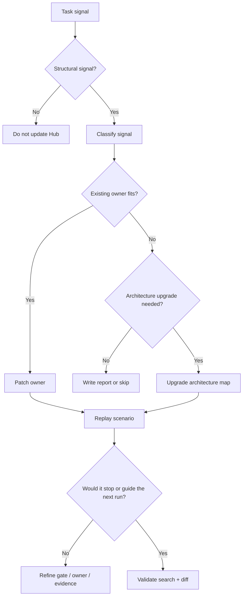

# Agent Hub Architecture

日期：2026-06-25
用途：作为 Agent Hub 后续迭代的架构蓝图。每次升级 Hub 时先沿这个架构落位；确实不适配时显式升级架构，而不是次次重来。

## Architecture Laws

1. **README 是核心总览**：只放 Hub 定位、最高法则、工作方向、路由和目录图。
2. **AGENTS 是通用执行入口**：放跨工具硬约束、加载顺序、P0/P1 gate 和高频协作规则。
3. **agents 是工具适配层**：只表达 Codex、Cursor 等宿主差异和工具能力映射。
4. **skills 是 workflow 层**：每个 Skill 承载一个可重复触发的工作流，包含 trigger、步骤、输出和质量门槛。
5. **references 是深水区**：长 checklist、矩阵、反模式、执行细则和架构说明放在相关 Skill 的 `references/`。
6. **reports 是证据层**：保留项目、个人、公司维度的结论、证据、设计取舍和历史记录；不默认全量加载。
7. **兼容入口不做事实源**：`.agents/skills` 等桥接入口只负责发现，真实维护源仍在 `skills/`。

## Layer Map

| Layer | Owner | Content | Change Rule |
| --- | --- | --- | --- |
| `README.md` | Hub overview | 核心法则、方向、路由 | 只做减法或极短索引 |
| `AGENTS.md` | Shared runtime policy | 加载顺序、硬约束、通用 gate | 只放高频规则和触发指针 |
| `agents/<tool>.md` | Tool adapter | 宿主能力、工具限制、fallback | 不复制通用规则 |
| `skills/<slug>/SKILL.md` | Workflow owner | 触发、步骤、输出、质量门槛 | 一个 Skill 一个清晰 owner |
| `skills/<slug>/references/` | Workflow depth | 长检查表、矩阵、架构蓝图、反例 | 只由对应 Skill 按需加载 |
| `reports/` | Evidence and history | 项目事实、结论、复盘、设计取舍 | 有生命周期，不进默认入口 |

## Evolution Protocol

Hub 迭代前先回答四个问题：

1. **这是架构内落位，还是架构升级？**  
   能归入现有 layer 时优先归位；不能归入时，先说明缺的新 layer 或 owner。

2. **这是通用机制，还是项目差异？**  
   通用机制进入 `AGENTS.md` / Skill / reference；项目差异进入对应 project report 或 project README。

3. **这是入口规则，还是执行细则？**  
   高频触发和硬约束留入口；长流程、样例、矩阵下沉 reference。

4. **这次修改会让加载更准，还是只让内容更多？**  
   如果只是增加内容量，默认不通过；优先合并、删除、下沉或重命名旧内容。

## Self-improvement Workflow

## Artifact Types For Better Learning

文字规则不是唯一手段。为了让 Hub 越迭代越强，可以按需要沉淀这些资产：

- **Decision matrix**：用于 owner、Run Case/Build Capability、Skill/Rule/Reference/Report 分类。
- **Workflow diagram**：用于表达跨层执行顺序、gate 和回放链路。
- **Coding example**：用于展示工具适配、schema closure、验证脚本或 prompt/template 的最小可运行样例；示例必须放在对应 Skill/reference，不放 README。
- **Replay checklist**：用历史失败场景回放新规则是否能提前触发。
- **Golden prompt / handoff template**：用于视频、研究、PR 描述、case handoff 等高复用输出；模板归属对应 Skill。
- **Validation snippet**：`rg` 搜索、diff check、UI smoke、media probe、SDK contract test 等可复用验证片段。

新增这些资产前仍需过内容分类：如果只是当前项目证据，写 report；如果能指导未来执行，放 Skill/reference；如果是工具差异，放 `agents/`。

## Architecture Upgrade Gate

只有满足以下至少一项，才升级 Hub 架构本身：

- 现有 layer 无法表达新的稳定 owner。
- 同类内容反复落错层，说明承载边界不清。
- 某个入口过大，已经降低加载效率和触发准确度。
- 多项目差异需要新的隔离方式，而 reports/project README 无法承载。
- 工具适配或自动发现机制发生变化，兼容入口需要重新定义。

架构升级必须同步：

- 更新本文件的 layer map 或 evolution protocol。
- 更新 `README.md` 的极短路由，若新增了一级目录或核心入口。
- 更新 `AGENTS.md` loading order，若新增了默认可触发 owner。
- 搜索旧称、旧路径和重复规则，避免新旧架构并存。

## Anti-patterns

- 把 README 写成百科或长协作说明。
- 把一次事故直接写成通用规则。
- 为了“完整”新增目录、Skill、reference 或报告类型。
- 同一规则在 README、AGENTS、Skill、report 多处复制。
- 项目专属事实进入通用入口。
- 架构已经不合适却继续补丁式堆规则。
